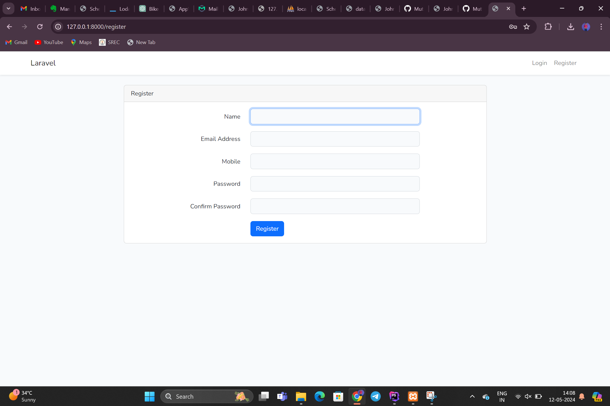
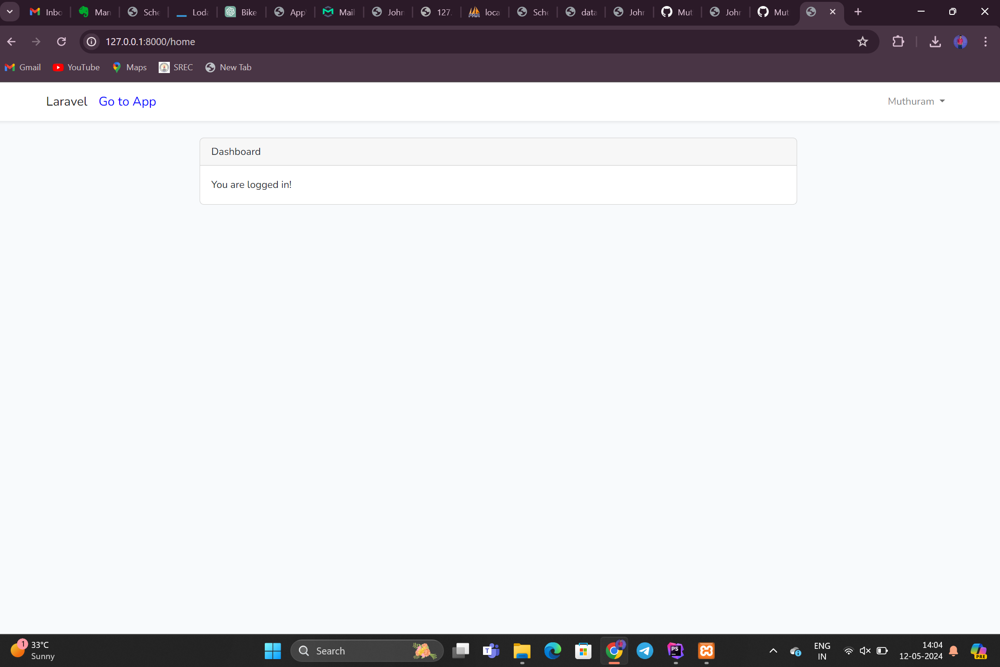
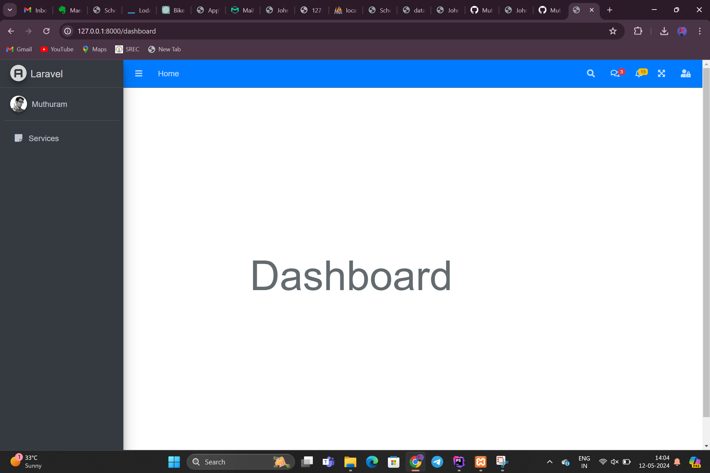
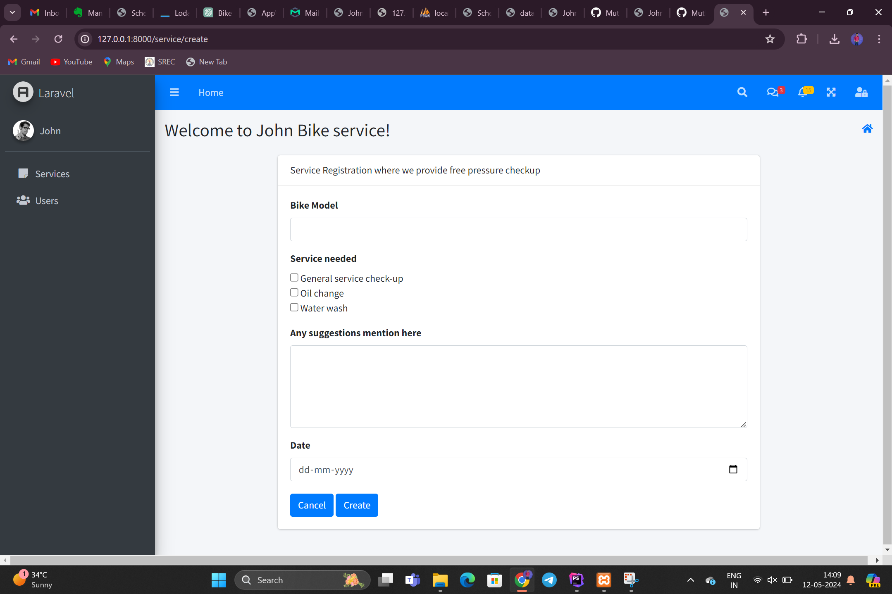
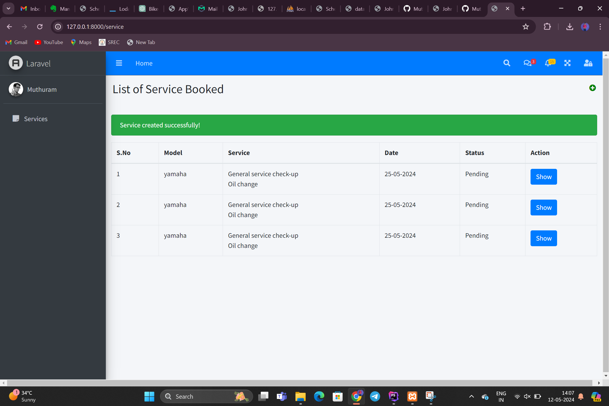
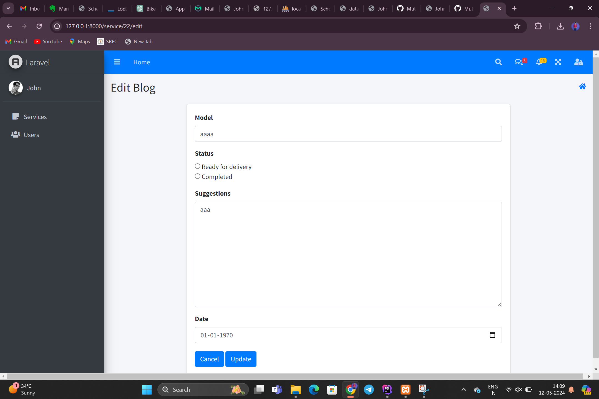
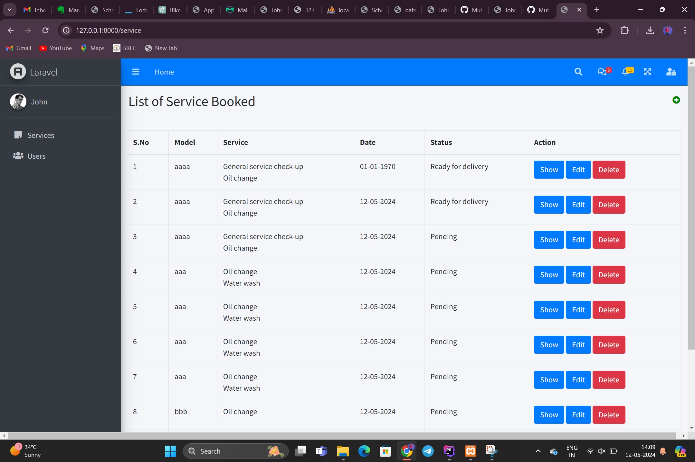
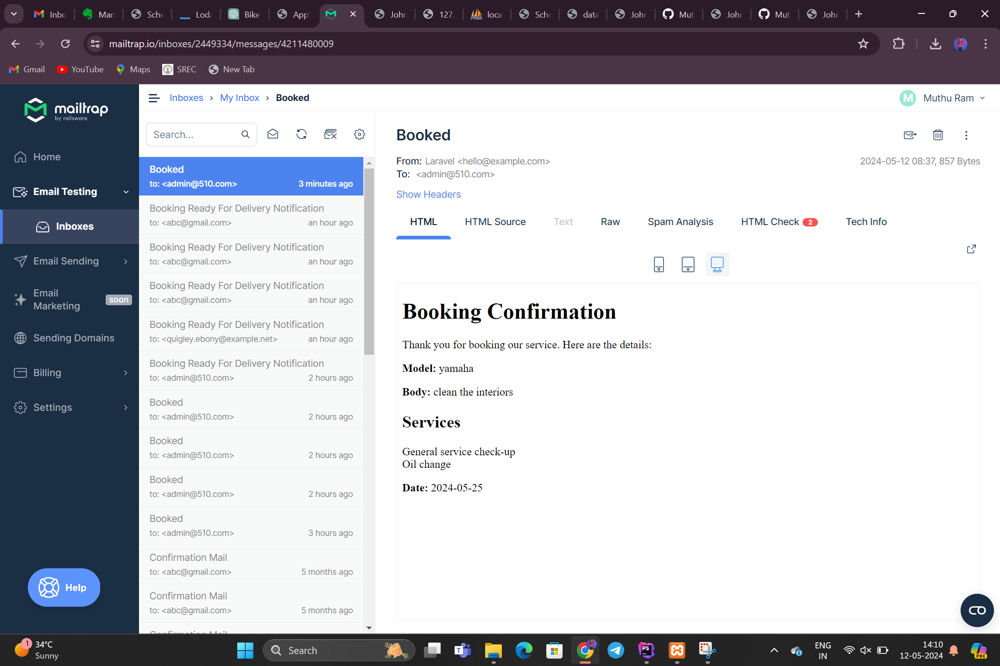
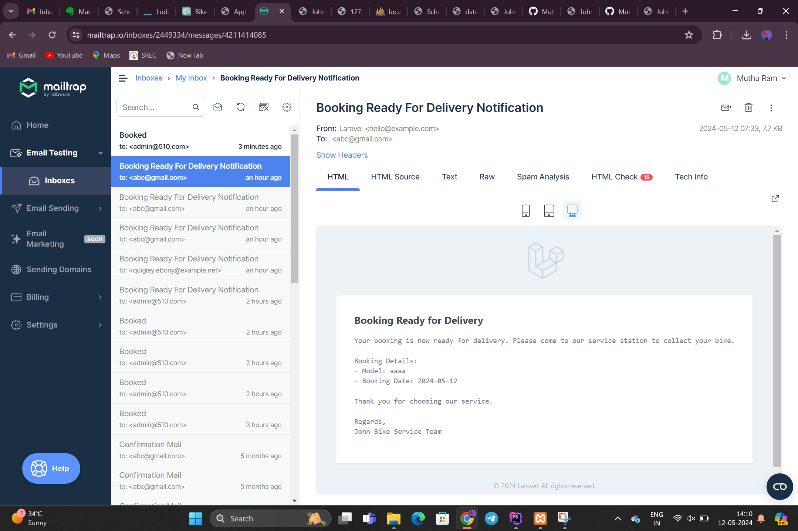

## Base Code installation
In top, you can see the Login, register button click on that.

User can register using their Email and Mobile Number.

- Log in using the admin(John) credentials.
  - Email: admin@510.com
  - Password: password123
  - If you want to login as customer then various accounts are seeded inside some of them are
  - Email: abc@gmail.com
  - Password: 12345678
  
  - Email: abc@gmail.com
  - password: 12345678
  
Here you need to click the "Go to App" which is located in top left corner.

Now you can see the dashboard of the application

In left sidebar, you can see the services and users if you logged in as admin else you will see services

In that you can see Plus icon on top right corner where customer can Book their services

Customer can choose their services on a particular date also they can give their personal suggestions

Customer can only see the details and status of their bookings

Admin can see all the list of booking along with edit and delete option

Admin can delete user and also make them as Admin if he wants.

once the booking is created mail is send to the John mail id (ie)admin@510.com

once admin edit the booking as 'Ready for Delivery', then mail will be sent to particular user mail id

I have provided my database schema as (bikeservice) along with my project in my repo.

## Note
- When adding a new user, the password will not be asked. Instead, the default password will be set to "password123".
